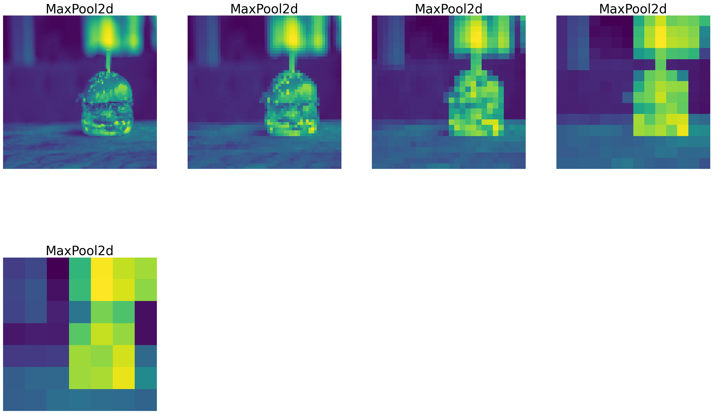

# PyTorchLayerViz

**PyTorchLayerViz** is a Python library designed to assist developers and researchers in visualizing the weights and feature maps of PyTorch models. This tool provides easy-to-use functions to help understand and interpret deep learning models, making it an essential utility for anyone working with PyTorch.

## Table of Contents

- [PyTorchLayerViz](#pytorchlayerviz)
  - [Table of Contents](#table-of-contents)
  - [Installation](#installation)
  - [Usage](#usage)
    - [Parameters](#parameters)
  - [Features](#features)
  - [Examples](#examples)
    - [Example Picture](#example-picture)
    - [Code](#code)
    - [Output](#output)
  - [Contributing](#contributing)
  - [License](#license)
  - [Contact](#contact)

## Installation

To install PyTorchLayerViz, you can use pip:

```bash
pip install pytorchlayerviz
```

## Usage

Here is a basic example of how to use PyTorchLayerViz:

```python
from pytorchlayerviz import get_feature_maps
import matplotlib.pyplot as plt
from PIL import Image
import torch
from torch import nn
from torchvision import datasets, transforms, models
from torchvision.transforms import ToTensor

# Define your model
model = torch.nn.Sequential(
    torch.nn.Conv2d(1, 20, 5),
    torch.nn.ReLU(),
    torch.nn.Conv2d(20, 64, 5),
    torch.nn.ReLU()
)

layers_to_check = [nn.Conv2d] # Define all Layers you want to pass your picture

input_image_path = 'pictures/hamburger.jpg' # Path to your example picture

get_feature_maps(model = model, layers_to_check = layers_to_check, input_image_path = input_image_path) # Call function from pytorchlayerviz
```

### Parameters

- **model (nn.Module)** – The PyTorch model whose layers' feature maps you want to visualize. *Required*.
- **layers_to_check (arr of nn.Module)** – List of layer types (e.g., `nn.Conv2d`) to check for feature maps. *Required*.
- **input_image_path (str)** – Path to the input image file. *Required*.
- **transform (transforms.Compose, optional)** – A function/transform that takes in an image and returns a transformed version. Default is None. *Optional*.
- **sequential_order (bool, optional)** – If True, the layers are visualized in the order they are defined in the model. If false it will first go through the first layer defined in the arrDefault is True. *Optional*.

If transform is none, this will be used:

```python
    transform = transforms.Compose([
    transforms.Resize((224, 224)),  # Resize the image to 224x224 pixels
    transforms.ToTensor(),  # Convert the image to a PyTorch tensor
    ])
```

If you want to pass your own transform, make sure you resize the image and convert it to a tensor with `transforms.ToTensor()`

## Features

* Visualize Weights: Easily visualize the weights of each layer in your PyTorch model.
* Visualize Feature Maps: Generate and visualize feature maps for given inputs.
* Customizable: Flexible options for customizing visualizations.


## Examples

### Example Picture


### Code

```python
pretrained_model = models.vgg16(pretrained=True)
input_image_path = 'hamburger.jpg'
layers_to_check= [nn.MaxPool2d]

get_feature_maps(model = pretrained_model, layers_to_check = layers_to_check, input_image_path = input_image_path, sequential_order = False)
```

### Output




## Contributing

I welcome contributions to PyTorchLayerViz! If you'd like to contribute, please follow these steps:

1. Fork the repository.
2. Create a new branch (*git checkout -b feature-branch*).
3. Make your changes.
4. Commit your changes (*git commit -m 'Add new feature'*).
5. Push to the branch (*git push origin feature-branch*).
6. Open a pull request.

## License

This project is licensed under the MIT License - see the [LICENSE](LICENSE.md) file for details.

## Contact

For any questions, suggestions, or issues, please open an issue on GitHub or contact me.

* Simone Panico: simone.panico@icloud.com
* Github Issues: https://github.com/simone-panico/PyTorchLayerViz/issues

